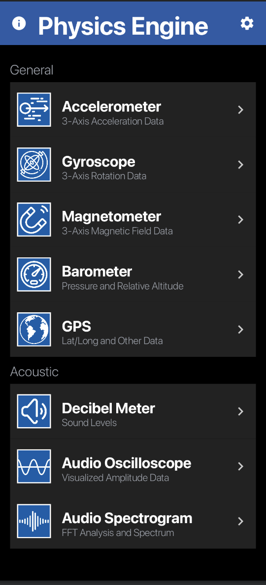

# Physics Engine (Android)

**Platform:** Android  
**Tech Stack:** Kotlin, Jetpack Compose  
**Project Type:** Mobile Application / UI & Data Visualization  
**Team Size:** 5

---

## Project Overview

Physics Engine is an Android application designed to provide real-time access to smartphone sensor data, enabling users to explore physical phenomena through interactive visualizations. The app exposes multiple built-in sensors—such as accelerometers, gyroscopes, and audio inputs—and presents their data in an intuitive, educational interface.

The project emphasizes usability, clarity of visualization, and responsiveness, making complex sensor data accessible to students and educators.

---

## My Contributions

I was a primary contributor to the **Android UI and visualization layer** of the application. My responsibilities included:

- Leading the **UI development** for the Android version of the app
- Designing and implementing **graphing fragments** that allow users to visualize complex sensor data in real time
- Translating raw sensor streams into **clear, interactive visual representations**
- Collaborating closely with a **team of five developers** to refine features, resolve UI/UX issues, and ensure seamless app behavior

My work focused on building a clean, consistent interface while maintaining performance across multiple sensor inputs.

---

## Features

### General Sensors
- Accelerometer (3-axis acceleration)
- Gyroscope (3-axis rotation)
- Magnetometer (3-axis magnetic field)
- Barometer (pressure and relative altitude)
- GPS (location and movement data)

### Acoustic Tools
- Decibel meter for sound level measurement
- Audio oscilloscope for waveform visualization
- Audio spectrogram with FFT-based frequency analysis

---

## UI & Visualization

The application interface was built using **Jetpack Compose**, allowing for:

- Declarative UI design
- Modular, reusable components
- Smooth navigation between sensor views
- Responsive layouts across devices

Each sensor module includes a dedicated visualization screen designed to clearly communicate trends, magnitudes, and changes in real time.

---

## Screenshots

### Sensor Selection Interface

### Light Mode Interface

*(Screenshots demonstrate the sensor navigation layout and visual consistency across themes.)*

---

## Collaboration & Development

- Agile, team-based development
- Regular feature reviews and UI feedback cycles
- Close coordination between UI and sensor-processing components

This project strengthened my experience working in a **collaborative mobile development environment**, balancing design decisions with technical constraints.

---

## Usage Note

This project was developed for educational and exploratory purposes. Sensor accuracy and availability depend on the underlying device hardware.
